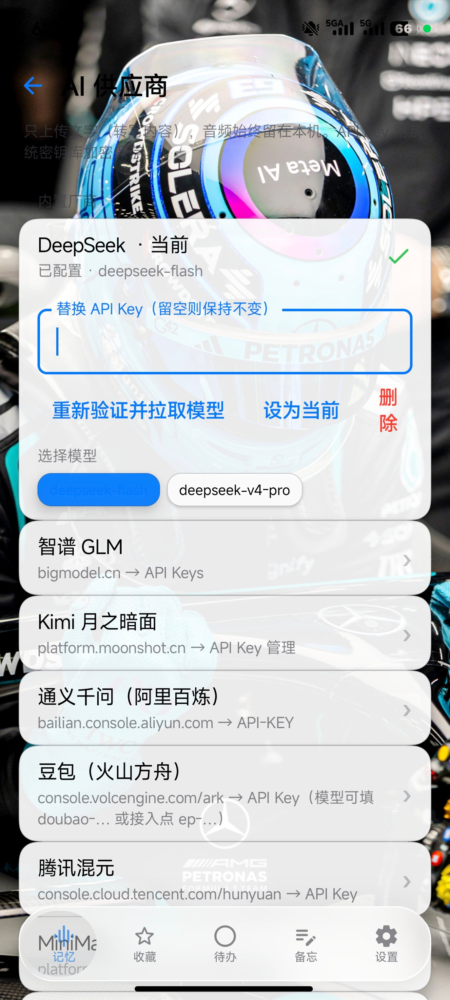

# 回声 Echo（recall-your-memory）

  

> 环境声环形录音 + 人声检测 + 本地转写 + 云端 LLM 总结问答的 Android 记忆回溯 App。
> iOS 设计语言 · 液态玻璃 UI · 底部 Dock 五大功能 · 本地转写全程离线。

完整产品与技术方案见 **[PLAN.md](PLAN.md)**。

## 界面预览

| 记忆回溯 | 收藏 | 待办 |
|:---:|:---:|:---:|
|  |  |  |
| **备忘** | **设置** | **液态玻璃调参** |
|  |  |  |

<details>
<summary>本地语音模型管理</summary>


</details>

## 功能

- **回声聆听**：后台常驻轻量监听（silero-vad），只在有人声时写入内存环形缓冲，保留最近 0.5–5 分钟（可调），取走即清空
- **一键回溯**：点击即取出窗口内的声音生成「记忆」，本地 SenseVoice 离线转写（逐段实时上屏），自动加标点
- **AI 联动**：记忆总结 / 追问（流式 SSE）、一键提取待办（转写全文 + AI 总结直接写入待办）
- **收藏 / 待办 / 备忘**：收藏永久保留，未收藏 7 天自动清理
- **液态玻璃 UI**：正版 [Kyant0 Backdrop](https://github.com/Kyant0/AndroidLiquidGlass) 实时折射（Dock / 回溯按钮 / 悬浮药丸），模糊 / 折射 / 色散 / 高光 / 染色全参数可调，三档降级（液态玻璃 / 毛玻璃 / 半透明）
- **壁纸**：自定义壁纸 + 内置裁剪（拖动 / 双指缩放取景），玻璃折射效果随壁纸呈现
- **保活**：前台服务 + 清后台自愈 + 快捷磁贴 + 通知一键恢复 + 分 ROM 保活引导

---

## 里程碑

| 阶段 | 内容 | 状态 |
|------|------|------|
| M0 | 工程脚手架、设计系统、Dock 导航、设置壳 | ✅ |
| M1 | 录音引擎：前台服务 + silero-vad + 环形缓冲 + 回溯 + 播放 | ✅ |
| M2 | 本地转写：模型管理（多镜像/续传/SHA256）+ SenseVoice 批转写 + 时间戳字幕 | ✅ |
| M3 | 云端 LLM：8 家供应商 + 模型列表拉取 + 记忆总结/追问 + 备忘润色 | ✅ |
| M4 | 收藏 / 待办 / 备忘交互 + 液态玻璃 UI + 7 天清理 | ✅ |
| M5 | 保活引导、快捷磁贴、续航实测、崩溃恢复、签名 APK | ✅ |
| **R1** | UI/UX 与液态玻璃重构（详见 [PLAN.md](PLAN.md) §14.1） | ✅ |

**验证门禁（全部通过）**：`testDebugUnitTest` **69 项测试 / 0 失败** · `assembleDebug` 通过 · `assembleRelease` 通过（R8 混淆 + 资源压缩，签名验证通过）

**R1 重构要点（2026-09）**：修复「立即本地转写」native 闪退（sherpa-onnx 构造参数误用）；工具链升级 Kotlin 2.4.10 / AGP 9.1.1 / Gradle 9.7.1 / Compose 1.12.1；液态玻璃换正版 **Kyant0 backdrop-android 2.0.1 + Shapes 1.2.1**（Dock 玻璃上玻璃滑块可拖动换页）；iOS 组件库、全局触感与 push 转场；清后台自愈保活；回溯转写逐段流式上屏；内置壁纸裁剪。

> 真机验收清单见 [docs/VERIFY.md](docs/VERIFY.md)（可用 `tools/verify-device.ps1` 自动跑一遍），交付与安装说明见 [docs/DELIVERY.md](docs/DELIVERY.md)。
> 液态玻璃现使用正版 [Kyant0/AndroidLiquidGlass](https://github.com/Kyant0/AndroidLiquidGlass)（backdrop 2.0.1）+ [Kyant0/Shapes](https://github.com/Kyant0/Shapes)（1.2.1）；升级记录见 [PLAN.md](PLAN.md) §14.1。

## 项目结构

```
.
├── PLAN.md                    产品与技术方案（先读这个）
├── build.ps1                  本地构建脚本（沙箱友好的环境变量 + Gradle 调用）
├── app/                       Android 应用模块
│   └── src/main/java/com/echo/recall/
│       ├── core/audio/        录音引擎（AudioRecord / VAD / 环形缓冲）
│       ├── core/asr/          本地转写（sherpa-onnx + SenseVoice）
│       ├── core/llm/          云端 LLM（OpenAI 兼容客户端 + 供应商注册表）
│       ├── core/data/         Room / DataStore / 仓库
│       ├── core/service/      前台服务、快捷磁贴、清理任务
│       ├── core/designsystem/ iOS 风格主题与组件（含液态玻璃容器）
│       ├── feature/           memory / favorites / todos / notes / settings
│       └── nav/               Dock 五大功能导航
├── tools/                     构建与验证小工具（JVM 编写，绕开 Windows Schannel 限制）
│   ├── Download.java          下载器（断点续传 + SHA-256 校验）
│   ├── HeadProbe.java         URL 连通性/体积探测
│   └── HttpProbe.java         HTTPS 连通性诊断
└── .gradle-home/              本机 Gradle 用户目录（含代理配置与 Gradle 发行版，**不入库**）
```

## 签名

Release 构建口令从根目录 `keystore.properties` 读取，该文件与 `keystore/` 目录均**不入库**。克隆后如需出签名的 release 包，需自建：

```properties
storeFile=keystore/echo-release.jks
storePassword=你的口令
keyAlias=你的别名
keyPassword=你的口令
```

没有该文件时会自动回退到 debug 签名，`assembleDebug` 与单元测试不受影响。

## 构建

```powershell
# 一次性：安装 JDK 17 与 Android SDK（本机已具备）
pwsh -File build.ps1 assembleDebug      # 产出 app/build/outputs/apk/debug/app-debug.apk
pwsh -File build.ps1 testDebugUnitTest  # 跑 JVM 单元测试
pwsh -File build.ps1 clean assembleRelease
```

`build.ps1` 会固定以下环境（因为运行环境不允许写工作区外的目录）：

| 变量 | 值 |
|------|-----|
| `JAVA_HOME` | `C:\Program Files\Microsoft\jdk-17.0.20.101-hotspot` |
| `ANDROID_HOME` | `%LOCALAPPDATA%\Android\Sdk`（按本机实际路径） |
| `GRADLE_USER_HOME` | `<repo>\.gradle-home` |
| `ANDROID_USER_HOME` | `<repo>\.android-home` |

网络：Maven/Gradle 下载经本机代理 `127.0.0.1:7897`（配置在 `.gradle-home/gradle.properties`）。

## 隐私原则

- 音频与转写 **100% 本地**：录音只进内存环形缓冲，取走即消失，绝不自动上传。
- 只有用户主动点 AI 功能时，才把**文字**发送到所选云端供应商（API Key 用 Android Keystore 加密存储）。
- 聆听期间常驻通知可见，随时可暂停。
